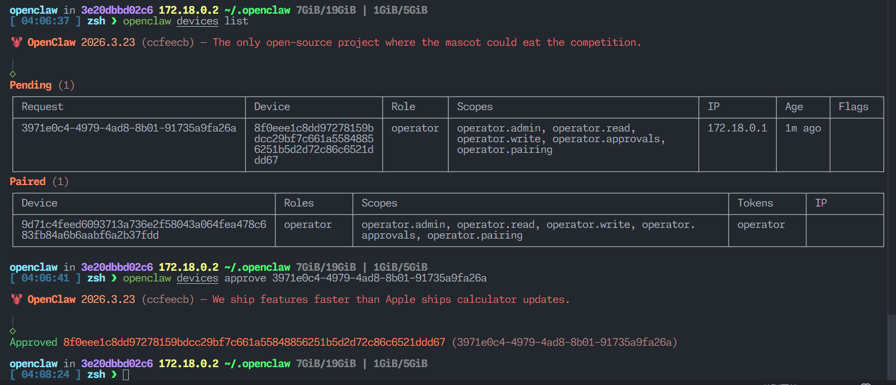

# Openclaw

> 一个运行在你自己设备上的个人 AI assistant。该镜像预装了 OpenClaw、ffmpeg、yt-dlp 以及常用 CLI 运行环境，默认启动 Gateway，也可以切换到 CLI 模式进行配置和排障

[](https://hub.docker.com/r/aliuq/openclaw)
[](https://hub.docker.com/r/aliuq/openclaw)

## 项目信息

- **上游仓库**: [openclaw/openclaw](https://github.com/openclaw/openclaw)
- **Docker 镜像**: [aliuq/openclaw](https://hub.docker.com/r/aliuq/openclaw)
- **Dockerfile**: [查看构建文件](https://github.com/aliuq/apps-image/tree/master/apps/openclaw)
- **官方网站**: [https://openclaw.ai/](https://openclaw.ai/)
- **官方文档**: [https://docs.openclaw.ai/](https://docs.openclaw.ai/)

## 快速开始

生成 Token，并保存到环境变量 `OPENCLAW_GATEWAY_TOKEN`，也可以在首次启动时让镜像自动生成（会在日志中输出）

```bash
openssl rand -hex 32
```

### 使用 Docker 运行

```bash
# 推荐：挂载配置目录并固定 Gateway Token
docker run -d \
 --name openclaw \
 -p 18789:18789 \
 -v ./data:/home/openclaw/.openclaw \
 -e OPENCLAW_GATEWAY_TOKEN=change-me \
 aliuq/openclaw:latest

# 本地调试：关闭设备配对认证，方便快速进入 Control UI
docker run --rm \
 --name openclaw \
 -p 18789:18789 \
 -e DISABLE_DEVICE_AUTH=true \
 aliuq/openclaw:latest
```

首次启动时，镜像会在日志中输出 Gateway Token；如果你没有显式传入 `OPENCLAW_GATEWAY_TOKEN`，每次重新创建容器时都可能生成新的 token

默认端口为 `18789`，Gateway 启动后可通过浏览器访问 `http://localhost:18789` 打开 OpenClaw 的 Control UI / Web 界面

### 使用 Docker Compose

创建 `docker-compose.yml` 文件：

```yaml
name: openclaw

services:
  openclaw:
    image: aliuq/openclaw:latest
    container_name: openclaw
    restart: unless-stopped
    ports:
      - '18789:18789'
    environment:
      OPENCLAW_GATEWAY_TOKEN: change-me
      OPENCLAW_GATEWAY_BIND: lan
    volumes:
      - ./data:/home/openclaw/.openclaw
```

运行服务：

```bash
docker-compose up -d
```

## Variant

两者都预装了以下核心组件：

- Openclaw
- Python
- mise
- ffmpeg
- yt-dlp
- zsh/ohmyzsh/starship

区别在于：

- `latest` 使用的用户名和用户 ID 都是 `openclaw`，符合一般的非 root 用户习惯
- `codebase` 使用 `root` 用户，额外还包含了 Docker、sshd 等工具

## 功能特性

- 🦞 **个人 AI Gateway**: 默认启动 OpenClaw Gateway，适合作为个人助手的控制平面
- 🌐 **多端接入**: 可与 OpenClaw 的 Web、CLI 以及移动端 / 桌面端节点配合使用
- 🔐 **安全默认值**: 默认启用 token 鉴权与设备配对机制，避免直接暴露未鉴权入口
- ⚙️ **运行时配置生成**: 首次启动时可通过 `OC_*` 环境变量自动生成 `openclaw.json`
- 🎬 **媒体能力支持**: 镜像内预装 ffmpeg 与 yt-dlp，便于处理音视频相关能力
- 🛠️ **运维与排障友好**: 可切换到 CLI 模式执行 `doctor`、`devices`、`channels` 等命令

## 配置说明

### 数据持久化

建议将 `/home/openclaw/.openclaw` 挂载到宿主机目录，这里通常会保存：

- `openclaw.json` 配置文件
- 认证信息与本地状态
- workspace 与其他运行时数据

### 环境变量

| 变量名 | 默认值 | 说明 |
|--------|--------|------|
| `RUN_MODE` | `gateway` | 启动模式，支持 `gateway`、`cli`，其他值会直接执行原始命令 |
| `OPENCLAW_GATEWAY_BIND` | `lan` | Gateway 监听地址 |
| `OPENCLAW_GATEWAY_PORT` | `18789` | Gateway 监听端口 |
| `OPENCLAW_GATEWAY_TOKEN` | 自动生成 | 固定 Gateway Token；未设置时会在容器启动时随机生成 |
| `ALLOWED_ORIGINS` | `http://localhost:18789`,`http://127.0.0.1:18789` | Control UI 允许的来源 |
| `INSECURE_AUTH` | `false` | 是否允许不安全的 Control UI 鉴权方式 |
| `DISABLE_DEVICE_AUTH` | `false` | 是否关闭设备配对认证，仅建议本地调试时使用 |
| `STARSHIP_CONFIG` | - | 可选，自定义容器内 shell 的 Starship 配置，支持 URL 或文件路径 |

### `OC_*` 配置写入规则

> `OC_*` 存在的目的仅仅只是为了**第一次**启动时用户能够进入 Gateway UI

镜像入口脚本会在首次启动时检查是否存在 `openclaw.json`。如果配置文件不存在，则会把所有以 `OC_` 开头的环境变量转换为 OpenClaw 配置并写入文件

具体可查看文件 [update_config.mjs](apps/openclaw/update_config.mjs)

1. 去掉 `OC_` 前缀
2. 将剩余部分按双下划线 `__` 分割成层级
3. 将层级转换为小写并用点号 `.` 连接，形成最终的配置键

示例：

- `OC_AGENT__MODEL=anthropic/claude-opus-4-1` 会被转换为 `agent.model=anthropic/claude-opus-4-1`
- `OC_CHANNELS__TELEGRAM__BOT_TOKEN=123456:example` 会被转换为 `channels.telegram.botToken=123456:example`

此外，还提供了几个特殊的环境变量，仅为了简写：

- `ALLOWED_ORIGINS`
- `INSECURE_AUTH`
- `DISABLE_DEVICE_AUTH`

```bash
docker run -d \
 --name openclaw \
 -p 18789:18789 \
 -v ./data:/home/openclaw/.openclaw \
 -e OPENCLAW_GATEWAY_TOKEN=change-me \
 -e OC_AGENT__MODEL=anthropic/claude-opus-4-1 \
 -e OC_CHANNELS__TELEGRAM__BOT_TOKEN=123456:example \
 aliuq/openclaw:latest
```

需要注意：

1. `OC_*` 变量**只会在创建配置文件时生效**
2. 如果 `openclaw.json` 已经存在，后续重启容器不会重新覆盖
3. 如果你想重新根据环境变量生成配置，请先删除已有的 `openclaw.json`，或者直接进入容器手动修改该文件

## 使用方法

### 切换到 CLI 模式

如果你只想执行 OpenClaw CLI 命令，而不是启动 Gateway，可以将 `RUN_MODE` 设置为 `cli`：

```bash
docker run --rm -it \
 --name openclaw-cli \
 -e RUN_MODE=cli \
 -v ./data:/home/openclaw/.openclaw \
 aliuq/openclaw:latest doctor
```

也可以在已经运行的容器里直接进入 shell：

```bash
docker exec -it openclaw /bin/zsh
```

### 设备配对

OpenClaw 默认启用设备配对认证。如果你需要把移动端或其他节点接入当前 Gateway，通常需要先在 UI 中发起配对，再通过 CLI 查看和批准请求

## QA

### `pairing required` on Gateway UI

To pair a device with OpenClaw, first access the container's shell:

```bash
# openclaw is the name of the container, change it if you used a different name
docker exec -it openclaw /bin/zsh
```

Run the following commands to list and approve the device pairing request:

```bash
# Get the list of pending device pairing requests
openclaw devices list
# Get the request ID from the output of the previous command
# Approve the device pairing request using the request ID
openclaw devices approve <Request ID>
```



### Gateway 启动时提示安全警告

如果你使用了 `DISABLE_DEVICE_AUTH=true`，启动日志中会看到类似下面的提示：

```bash
[gateway] security warning: dangerous config flags enabled: gateway.controlUi.dangerouslyDisableDeviceAuth=true. Run `openclaw security audit`.
```

这表示你关闭了设备认证，适合本地临时调试，但不适合长期使用或暴露到公网

## 开发

### 本地构建

```bash
# 克隆仓库
git clone https://github.com/aliuq/apps-image.git
cd apps-image/apps/openclaw

# 构建运行镜像
docker buildx build -f ./Dockerfile -t openclaw:local --load .

# 运行测试
docker run --rm --name openclaw-local -p 18789:18789 -e DISABLE_DEVICE_AUTH=true openclaw:local
```

### 调试 / 代码环境镜像

仓库中还提供了 `Dockerfile.codebase`，适合在本地构建一个更偏开发用途的镜像：

```bash
docker buildx build -f ./Dockerfile.codebase -t openclaw:local-codebase --load .
```

## 注意事项

- 建议始终挂载 `/home/openclaw/.openclaw`，否则容器重建后配置、token 和状态会丢失
- 不显式设置 `OPENCLAW_GATEWAY_TOKEN` 时，Gateway Token 由入口脚本在启动时生成
- `DISABLE_DEVICE_AUTH=true` 只建议用于本机调试，不建议在公网环境使用
- 如果通过 `OC_*` 初始化了配置，后续修改优先直接编辑 `openclaw.json`

## 相关链接

- [OpenClaw 官网](https://openclaw.ai/)
- [OpenClaw 文档](https://docs.openclaw.ai/)
- [Docker 安装说明](https://docs.openclaw.ai/install/docker)
- [Gateway 配置参考](https://docs.openclaw.ai/gateway/configuration)

---

> 📝 该文档由 AI 辅助生成并整理，如有问题请随时反馈
